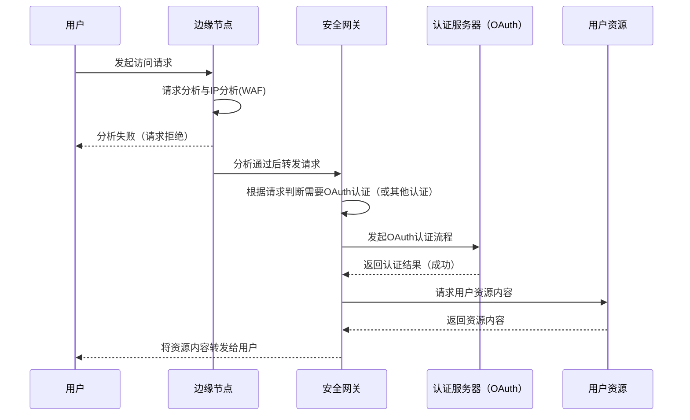
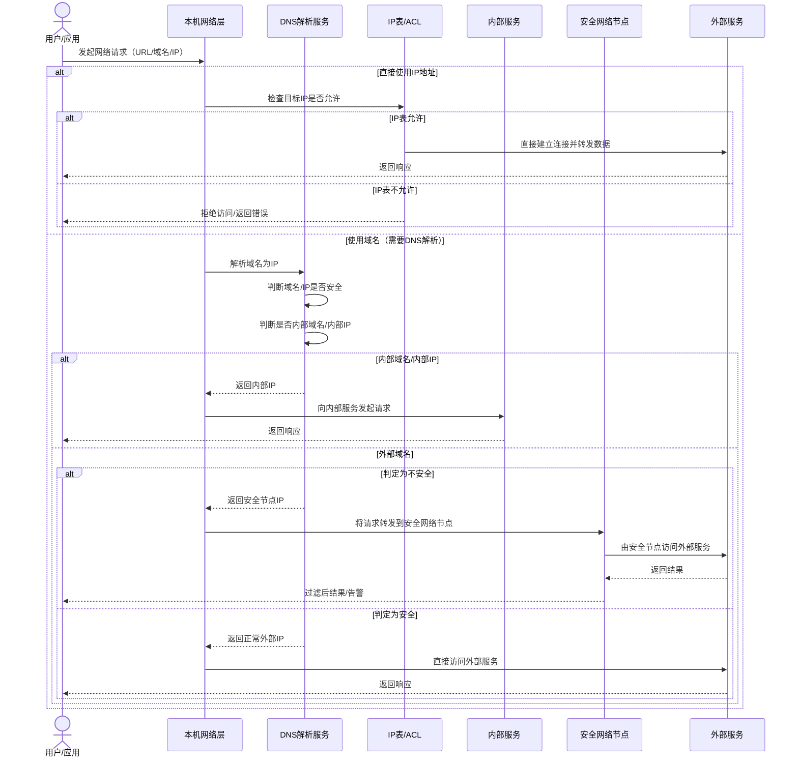
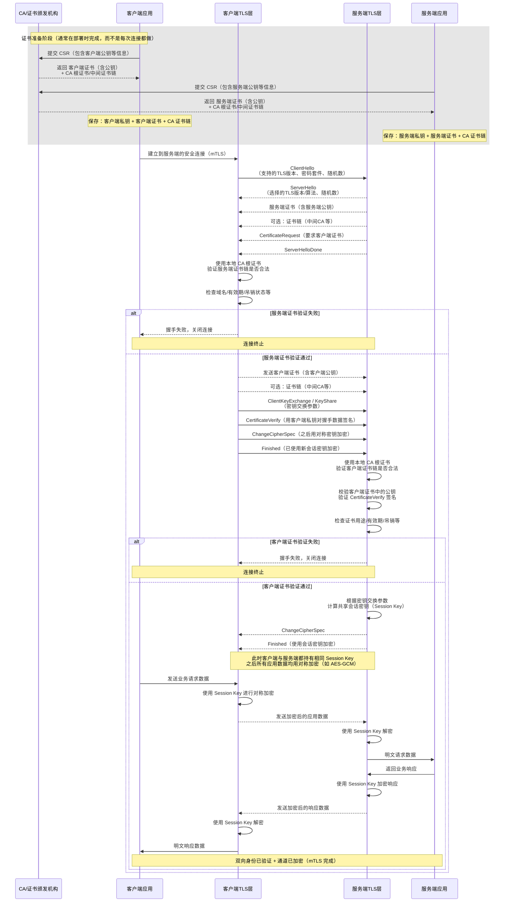

# 云梦镜像全球安全网络

## 简介

云梦镜像全球安全网络（DreamReflex Global Security Network）是一个由云梦镜像独立维护，部署全球的零信任网络，用于保护和分发客户的内容，确保全世界的所有用户都能够安全的访问其私有资源。

GSN来自于绿荫独立镜像网络（Green Shade Independent Mirror Network），网络架构为独立源分发，用户的资源部署在我们的专属服务器中，通过零信任网络来分发至全球。

## 关于安全网络

我们使用零信任构建了我们的安全网络，通过零信任架构，我们构建了一套全球分发网络（Global Distribution Network），为客户的数据提供最高级别的安全防护与全球范围的高速访问。

在整个体系中，客户的核心数据被安全地存储在独立服务器上，并受到严格的访问控制保护。我们通过 mTLS（双向认证 TLS） 和多层加密隧道，将数据以最安全的方式分发至世界各地的节点服务器。无论用户身处何地，都可以以安全可靠的方式访问资源。

整个网络遵循“从不信任、始终验证”的原则：

* 零信任安全模型确保每一次访问都经过身份与权限验证；
* 端到端加密传输避免数据在途中的任何泄露风险；

安全网络的核心特征是核心网用不暴露，核心网的网关只会单向分发到边缘节点，而客户的数据只会暂存到客户所在的分段，在这样的架构设计下，能够从理论上杜绝网络攻击和内部横向移动。
为了让用户了解我们的安全措施，该白皮书旨在说明安全网络的工作原理和工作流程。同时为了阅读便捷，下面提出如下术语定义：

### GSN

GSN或IMN通常指的是云梦镜像全球安全网络（DreamReflex Gloabl Security Network），由于GSN来自于绿荫独立镜像网络（Green Shade Independent Mirror Network），因此在迁移文档过程中术语可能会混用。

### Edge

Edge或边缘节点：指的是在全球部署的各个分发节点，通常这些节点和他们的关联的DNS基础设施不是由云梦镜像直接提供的，可能来自我们的合作伙伴或上游基础设施，例如在北美地区的Microsoft Azure、Google Cloud、Cloudflare，亚洲地区的阿里云、腾讯云、HiChina等。这些部署在全世界各地的节点被称为边缘节点，他们不直接存储任何客户信息，只进行分发和加速。边缘节点通常使用AnyCast或类似的多播技术来保障用户的请求能够在最近的节点被处理响应。

### ZTNA

Zero Trust Network Access零信任网络访问：指的是发起请求时通常需要确保安全和身份验证，不论是客户端发起的请求还是应用间的通信。下面对零信任网络中的相关概念进行解释：

身份与访问管理：指的是对于客户发起的请求，客户需要根据项目需要进行身份验证，通常为OAuth或邮箱身份验证。

设备安全与合规检测：对访问资源的设备和终端进行检测，例如HTTPS环境，浏览器安全，指纹安全和入侵检测。

微分段：将网络拆成极小的安全区，这些安全区通常只有几个端口映射甚至一个P2P端口构成的安全映射。对于Peer间的请求，通常使用mTLS技术进行保护和认证。在我们的Service Mesh中，您可以使用公共CA来自建一个中间CA来构建属于您的PKI体系。您可以访问[PKI Repo](https://github.com/dreamreflex/cert-trust)来下载这些资源。

数据保护：在整个流程中，数据加密、数据授权和数据签名是三大核心内容，我们的常规加密方案中，使用AES-256-GCM进行数据加密，使用我们的独立PKI进行数据签名，使用统一配置管理进行数据授权。

## 工作方式

对于用户的资源，我们按网络方向分为单向入站、单向出站和双向通信三种。

### 单向入站的保护

单向入站指的是在不可信网络（公共互联网）中向安全网络发起的请求。主要思路是入站的请求如何进行标识和访问控制。请求首先会经过边缘安全节点的过滤，随后进行访问授权，授权通过后由安全管理中心颁发认证标识信息，用户请求经过认证标识后再访问资源。

访问：[邮箱OTP测试页面](https://gsn-otpdemo.dreamreflex.com)来测试这个认证流程。

边缘节点的作用：边缘节点首先会判断请求的合理性和安全性，拦截爬虫、AI爬虫、DDoS攻击、高风险IP、带有恶意构造的请求等。在验证请求的合理性后边缘节点会将请求转发到我们的内部安全网络，此时请求会被转移到核心网中。

内部核心网，内部核心网会对请求进行拦截和要求认证，认证成功后响应上游资源。需要注意的是，如果在认证中使用OAuth进行认证，那么跳转到的OAuthIdP并不在我们的保护之中，如果您使用了云梦镜像的CSA，那么此次跳转仍会被跳转到边缘节点之外，因为零信任网络的每次验证要求，携带授权信息的请求仍会被检测过滤一次或多次。

### 单向出站的保护

单向出站指的是从安全网络中向外部网络（例如公共互联网）发送数据，主要思路是控制流量和控制出口管理。请求首先会通过可信的DNS基础设施进行流量引导，受益于我们的独立DNS基础设施，所有的DNS项目和DoT、DoH请求都会被拦截检查，并导向安全的出口。

DNS基础设施的作用：DNS基础设施是内部的DNS出口，用于对IP进行筛选，当DNS的目标IP是不可信IP或风险IP时，DNS会提前做出响应。

出口拦截：通常用户资源的出站目标也是我们的安全网络，因此在满足出站目标仍是安全网络的情况下，我们会通过AnyCast引导用户走安全网络，避免BGP劫持。

### 双向通信

双向通信指的是两个应用之间或资源与资源之间进行通信，这个通信链路可能会经过不可信网络，也可能遭遇拦截、劫持、恶意攻击的横向移动等，为避免数据泄露和劫持，主要思路是构建在不可信网络中的可信信道。这里使用的是mTLS技术，应用建立前会先搭建可信通道，并使用PKI来签发证书进行身份验证。基本流程是，请求客户端和请求服务端同时使用我们的PKI进行加密和签名，随后构建安全通道，发送数据。

mTLS的作用：mTLS会从我们的公钥基础设施中获取用于加密的密钥和证书，通常客户端和服务端都会进行证书的获取操作，随后进行sni对齐，确定通路并允许多路复用，由上级服务提供者进行host路由，建立连接后再进行通信。

